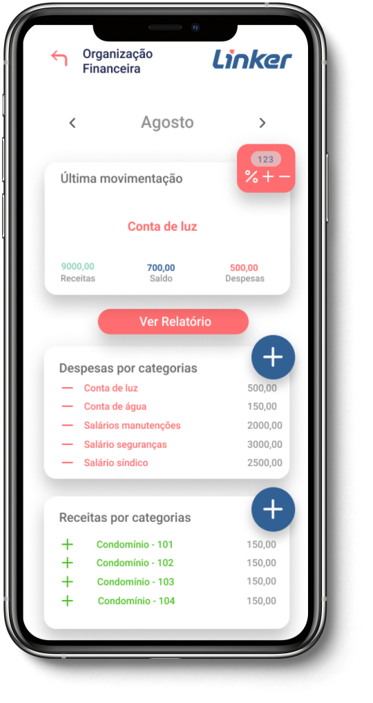

<h1 align ="center" display= 'flex'>
    </img>
</h1>

## Linker Faça+ 🚀 em construção... 🚧


## 💻 Sobre o projeto
Gerencie pagamentos e receitas fixas e variáveis aliadas a um relatório de negócios que possibilita a categorização dos custos e apresenta os dados da forma mais clara possível.
Tudo isso dentro de um único app, com possibilidade de exportação dos dados para seu contabilista.
<br>
<br>
<br>
<strong>ORGANIZE</strong>
<br>
Monte relações mensais de gastos fixos e contas a pagar. Assim, é possível
analisar o que é essencial, o que é possível negociar ou reduzir.
<br>
<br>

<strong>COMPARTILHE</strong>
<br>
Agrupe, categorize e exporte relatórios visuais e brutos para facilitar a
leitura dos dados pelo seu contador ou equipe financeira.
<br>
<br>

<strong>AMPLIE</strong>
<br>
Receba dicas, aprenda e conheça mais sobre gestão financeira através de
artigos e posts do próprio blog do Linker
<br>

## 🛠 Tecnologias

- React Native
- Expo
- Typescript
- Node

## 🎨 Layout
- [Figma](https://www.figma.com/file/R1NyldeRzUlMEI0Gmb2FmR/Linker-2.0?node-id=4%3A11)

## 🤖 Equipe
- [Bianca](https://github.com/bkkater)
- [Juliana](https://www.linkedin.com/in/juliana-talita-b683581b2/)
- [Eduarda](https://www.linkedin.com/in/eduarda-barboza-tavares-612a55159/)
- [Jhennifer](https://www.linkedin.com/in/jhennifer-pimentel-0518171b2/)


## 📏 Mentoras
- [Simone Hipólito](https://www.linkedin.com/in/simonehipp%C3%B3lito/)
- [Julia Villas Bôas](https://www.linkedin.com/in/julia-villas-b%C3%B4as-65196a97/?originalSubdomain=br)
- [Isa Teixeira](https://www.linkedin.com/in/isaraquelt/)


### 📱 Como Rodar o Projeto
Para rodar o projeto mobile você precisa de um celular com o [expo](https://play.google.com/store/apps/details?id=host.exp.exponent) instlado ou um emulador android/ios.

```bash
# Vá para a pasta linker2.0
$ cd linker2.0

# Instale as depedencias
$ yarn install

# Rode a aplicação
$ yarn start
```
Depois leia o QRCode com o app do [expo](https://play.google.com/store/apps/details?id=host.exp.exponent) ou rode em um emulador.

